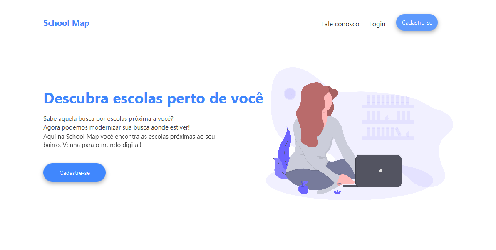

# School Map

<h1 align="center">
  
</h1>

## 💻 Tecnologias 

Esse projeto foi desenvolvido com todas essas tecnologias:

- [Java-SDK-11](https://www.oracle.com/java/technologies/javase-jdk11-downloads.html)
- [JavaFx](https://openjfx.io/)
- [Scene Buider](https://gluonhq.com/)
- [JavaFX Material Design Library](https://github.com/jfoenixadmin/JFoenix)
- [MySQL-workbench](https://www.mysql.com/products/workbench/)
- [Eclipse](https://www.eclipse.org/)

## 📖 Sobre o Projeto

O School Map é um projeto que se preocupa em conectar alunos e seus respectivos responsaveis a sistemas educacionais proximos a região ou bairro. Sendo assim, auxiliando na busca de uma instituição.

## 🏫 Mais informações

O projeto School Map foi desenvolvido para concluir os requisitos do terceiro semestre do Bacharelado de Sistemas de Informação, na instituição Centro Universitário Senac. 
Os requisitos eram: 

- Utilizar o paradigma da programação orientada a objetos(POO).
- Integração com Banco de Dados consumindo uma API do Estado de São Paulo.
- Aplicar Estrutura de Dados no código.
- Desenvolver o projeto visando o usuário, ou seja, utilizando User Experience(UX).

<h1 align="center">
  
</h1>

## 🤔 Como utilizar o projeto?

<ol>
  <li>Faça um clone desse repositório.</li>
  <li>Vá até a IDE Eclipse > File > Import > Maven > <em>Existing Maven Projects</em> > Browser</li>
  <li>Selecione o projeto que você clonou do repositório.</li>
  <li>Marque o checkbox do arquivo Pom.xml > Finish.</li>
  <li>Selecione o projeto dentro da IDE(Package Explorer).</li>
  <li>Com o botão direito do mouse clique em Run As > Java Application</li>
  <li>Prontinho! 😁</li>
</ol>

## ⚠️ <b>Psiu!</b>

### Se acontecer algum erro enquanto você tenta executar o programa, siga o passo a passo: 😉

<ol>
  <li>Clique em <b>Run As</b> > <b>Run Configurations...</b> > <b>Java Application</b> > <b>Arguments</b> > <b>VM Arguments</b></li>
</ol>

Agora adicione como <em>argumento </em><a href="github/arguments.txt" download>clique aqui.</a>

Pronto! Tente executar o programa novamente.
